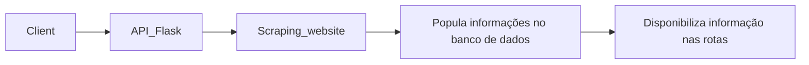

# Tech Challenge 1 - Machine Learning Engineering | FIAP 08/2025

# Desenvolvimento de API com Web Scraping

## Sumário
1. [Introdução](#introdução)
2. [Requisitos do tech challenge](#requisitos-do-tech-challenge)
3. [Rotas](#rotas)
4. [Documentação de rotas](#documentação-de-rotas)
5. [Arquitetura](#arquitetura)
    - [Pipeline de Ingestão](#pipeline-de-ingestão)
    - [Organização do projeto](#organização-do-projeto)

## Introdução
O projeto apresentado nesse repositório trata de um webscraping do site [books.toscrape.com](https://books.toscrape.com). Basicamente o projeto realiza uma raspagem e obtém as informações dos livros presentes no site. Uma vez realizada a raspagem, os dados são armazenados em um banco de dados para o consumo via API.

## Requisitos do tech challenge
- Definição da arquitetura.
- Criação de um script para raspagem de dados.
- API REST para consumo das informações.
- Documentação utilizando Swagger.
- Deploy em ambiente produtivo.

## Rotas
- GET /api/v1/books: Lista todos os livros disponíveis na base de dados.
- GET /api/v1/books/{id}: Retorna detalhes completos de um livro específico pelo ID.
- GET /api/v1/books/search?title={title}&category={category}: Busca livros por título e/ou categoria.
- GET /api/v1/categories: Lista todas as categorias de livros disponíveis.
- GET /api/v1/health: Verifica status da API e conectividade com os dados.
- GET /api/v1/books/price-range?min={min}&max={max}: Filtra livros dentro de uma faixa de preço específica.
- GET /api/v1/books/top-rated: Lista os livros com melhor avaliação (rating mais alto).
- GET /api/v1/stats/categories: Estatísticas detalhadas por categoria (quantidade de livros, preços por categoria).
- GET /api/v1/stats/overview: Estatísticas gerais da coleção (total de livros, preço médio, distribuição de ratings).
- POST /scrape_to_database: Realiza processo de webscraping e armazena em banco de dados.
- POST /scrape_to_csv: Realiza processo de webscraping e armazena em arquivo csv.

## Documentação de rotas
### Uso local
http://localhost:5000/apidocs

## Arquitetura
### Pipeline de Ingestão


### Organização do projeto
```
.
├── app
│   ├── api
│   │   └── routes
│   │   	├ book_detail.py
│	│		├ books_list.py
│	│		├ book_search.py
│	│		├ book_top_rated.py
│	│		├ category_list.py
│	│		├ health_check.py
│	│		├ price_range.py
│	│		├ scraper.py
│	│		├ stats_category.py
│	│		├ stats_overview.py
│	│		└── docs
│	│			├── books_detail.yaml
│	│			├── books_list.yaml
│	│			├── book_search.yaml
│	│			├── book_top_rated.yaml
│	│			├── category_list.yaml
│	│			├── health_check.yaml
│	│			├── price_range.yaml
│	│			├── scraper.yaml
│	│			├── stats_category.yaml
│	│			└── stats_overview.yaml
│   ├── config
│   │   └── settings.py
│   └── infra
│       ├── auth
│       └── database
│			└── db_config.py
├── LICENSE
├── requirements.txt
├── main.py
└── README.md
```
